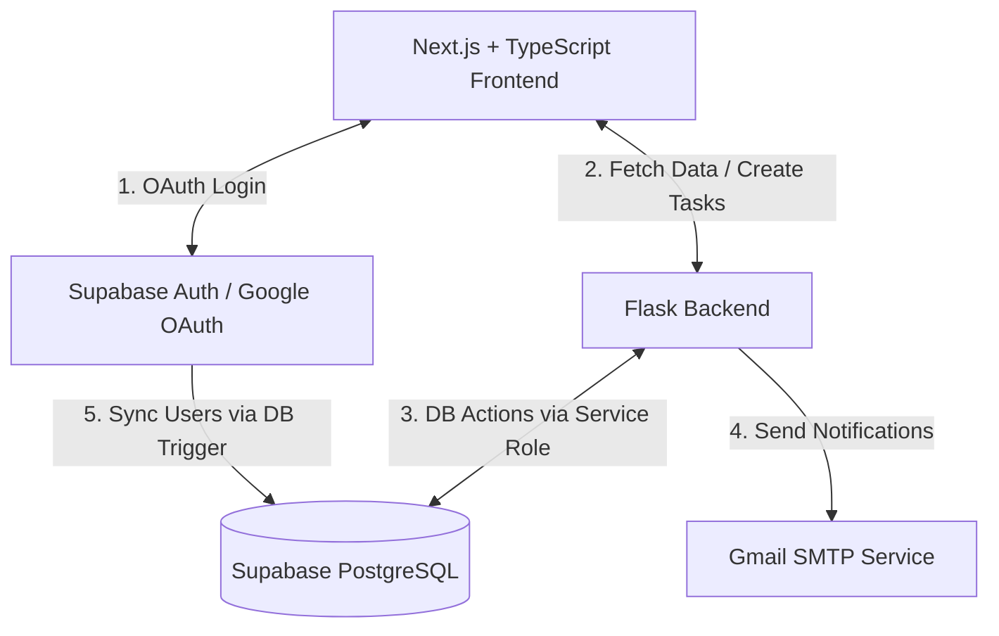

# TaskFlow - Premium Task Management System

TaskFlow is a premium, secure task management web application built with a modern decoupled architecture. It supports Google OAuth (via Supabase Auth), allows users to assign tasks, and sends real-time email notifications (using Gmail SMTP) upon task assignment and completion.

---

## System Architecture



### Key Components

1. **Frontend (Next.js + TypeScript)**:
   - Modern Next.js App Router project styled with a custom Vanilla CSS Glassmorphism design system.
   - Leverages `@supabase/supabase-js` to handle secure Google OAuth 2.0 logins.
   - Forwards Supabase Auth JWTs in the `Authorization: Bearer <JWT>` header to authenticate API calls made to the backend.
   - Configures local rewrites in development and Vercel rewrites in production to proxy `/api/*` requests to the Flask server, mitigating CORS issues.

2. **Backend (Flask)**:
   - Lightweight Python 3.13 API that serves as the operations and notifications orchestration layer.
   - Uses `PyJWT` to verify the incoming Supabase JWT tokens locally against the `SUPABASE_JWT_SECRET` (highly scalable, zero-network-overhead authentication).
   - Executes database operations using the administrative `supabase-py` client (service role) to manage database tables directly.
   - Integrates with Google's SMTP servers to send responsive HTML email notifications.

3. **Database (Supabase PostgreSQL)**:
   - Public schema containing `profiles` (synced automatically with Supabase's internal `auth.users` via database triggers) and `tasks` tables.
   - Employs Row Level Security (RLS) policies to protect access.

---

## Database Schema & Migrations

The SQL migrations are located under the `/migrations` folder:
- **[01_profiles_schema.sql](file:///migrations/01_profiles_schema.sql)**: Sets up the `public.profiles` table, configures an automated database trigger function (`handle_new_user`) that listens for insertions to Supabase Auth (`auth.users`), and maps user profile metadata (names/avatars).
- **[02_tasks_schema.sql](file:///migrations/02_tasks_schema.sql)**: Creates the `public.tasks` table storing task details, links constraints to profiles, sets up an `update_updated_at_column` trigger, and enforces RLS access control rules.

---

## Local Setup Instructions

### 1. Database Setup
1. Create a free project at [Supabase](https://supabase.com).
2. Go to **Project Settings -> API** and copy:
   - Project URL
   - Anon Public Key
   - Service Role JWT Secret (keep this secure!)
   - JWT Secret
3. Go to **Authentication -> Providers** and enable **Google**. Set up your client ID and client secret (refer to [Supabase Google Auth Docs](https://supabase.com/docs/guides/auth/social-login/auth-google)).
4. Open the **SQL Editor** in Supabase and run the migration scripts in order:
   - Run the content of `migrations/01_profiles_schema.sql`
   - Run the content of `migrations/02_tasks_schema.sql`

### 2. Backend Setup
1. Navigate to `/backend` directory.
2. Create a virtual environment:
   ```bash
   python -m venv venv
   source venv/Scripts/activate  # On Windows: venv\Scripts\activate
   ```
3. Install dependencies:
   ```bash
   pip install -r requirements.txt
   ```
4. Create a `.env` file from the template:
   ```bash
   cp .env.example .env
   ```
5. Populate variables inside `.env` (generate a Google Account App Password from Google Account Security settings for SMTP).
6. Run the local Flask server:
   ```bash
   python app.py
   ```
   *The server runs on `http://127.0.0.1:5000`.*

### 3. Frontend Setup
1. Navigate to `/frontend` directory.
2. Install npm packages:
   ```bash
   npm install
   ```
3. Create a `.env.local` file from the template:
   ```bash
   cp .env.example .env.local
   ```
4. Populate `NEXT_PUBLIC_SUPABASE_URL` and `NEXT_PUBLIC_SUPABASE_ANON_KEY`.
5. Run the dev server:
   ```bash
   npm run dev
   ```
   *The client will be running on `http://localhost:3000`.*

---

## Production Deployment

### 1. Database
- Your database is hosted on Supabase (already cloud-hosted).

### 2. Backend (Render / Railway)
- **Railway**: Connect your Git repository, select the `/backend` folder as the root directory, or deploy the `Dockerfile`. Add all environment variables from `backend/.env.example` to the Railway dashboard.
- **Render**: Create a new **Web Service**, select Python environment, set build command to `pip install -r requirements.txt`, and start command to `gunicorn -w 4 -b 0.0.0.0:$PORT app:app`. Configure environment variables under the "Environment" tab.

### 3. Frontend (Vercel)
- Create a new project on Vercel, connect your Git repository, and specify the root directory as `frontend`.
- Add variables `NEXT_PUBLIC_SUPABASE_URL` and `NEXT_PUBLIC_SUPABASE_ANON_KEY` to the project settings.
- **CORS Handling**: Update the placeholder URL in `frontend/vercel.json` with the final URL of your live Flask backend. Deploy! Vercel will automatically route `/api/*` calls from the browser to the backend without CORS errors.
